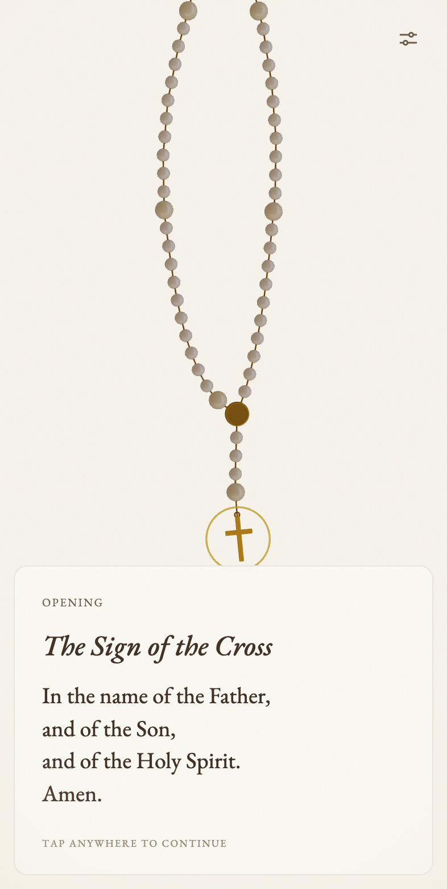
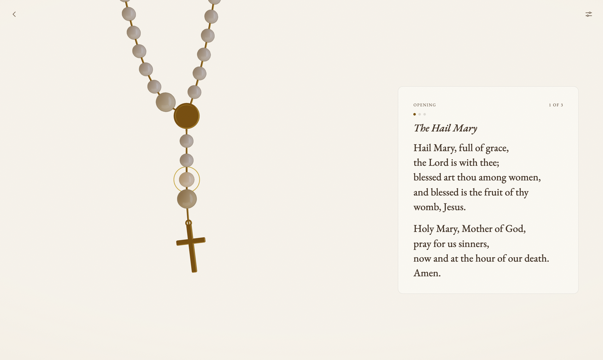

# Rosary

**A rosary you can hold.** An interactive 3D rosary for the web that keeps your place as you
pray — every prayer of the full traditional rosary, on every bead, in English and Spanish.

**[Pray at nacho2027.github.io/rosary →](https://nacho2027.github.io/rosary/)**

<p align="center">
  
  &nbsp;&nbsp;
  
</p>

## How it works

- **Tap anywhere** (or press <kbd>Space</kbd> / <kbd>→</kbd>) to move to the next prayer.
  The gold ring marks the bead you are on; prayed beads take on a gilt tint.
- **Drag** the rosary to swing it — the chain is simulated with real hanging physics.
- **Pinch or scroll** to zoom from the whole loop down to a single bead.
- **<kbd>←</kbd> or the back arrow** corrects a missed tap.
- Your place is saved locally, so you can close the tab mid-decade and resume.
- The correct mysteries are chosen by the day of the week (Luminous on Thursday, …),
  with a manual override in settings.

## The full rosary

Sign of the Cross, Apostles' Creed, opening Our Father, three Hail Marys and Glory Be,
then five decades — each with its mystery announcement and one-line meditation, Our
Father, ten Hail Marys, Glory Be, and the Fatima Prayer — closing with the Hail, Holy
Queen and final prayer. Prayer texts were verified against the Vatican's Compendium
(English and Spanish) and USCCB rosary resources.

## Craft notes

The design borrows from book typography rather than app conventions: EB Garamond
(a revival of the 1592 Egenolff–Berner Garamond) set with real small caps and old-style
figures, a parchment palette built in OKLCH with a single gold accent, and layout
proportions informed by the classical page canons. The prayer text brightens line by
line, like candlelight moving down a page.

The rosary itself is a single instanced mesh of 59 beads on a hand-rolled Verlet chain
(~120 particles, one draw call), lit by a procedural studio environment — no downloaded
assets, no loading screen. Total payload is ~330 KB gzipped, and it honors
`prefers-reduced-motion`.

## Development

```sh
npm install
npm run dev      # local dev server
npm test         # sequence-engine + physics tests (vitest)
npm run build    # production build to dist/
```

Built with React 19, TypeScript, Vite, react-three-fiber, zustand, and Tailwind CSS v4.

```
src/
  data/      the rosary domain: beads, praying sequence, verified prayer texts
  three/     verlet physics, the 3D rosary, camera rig, gesture bridge
  ui/        prayer card, settings, how-to-pray guide
  store.ts   prayer position + preferences (persisted)
```

## License

[MIT](LICENSE). The prayer texts are traditional and in the public domain.
